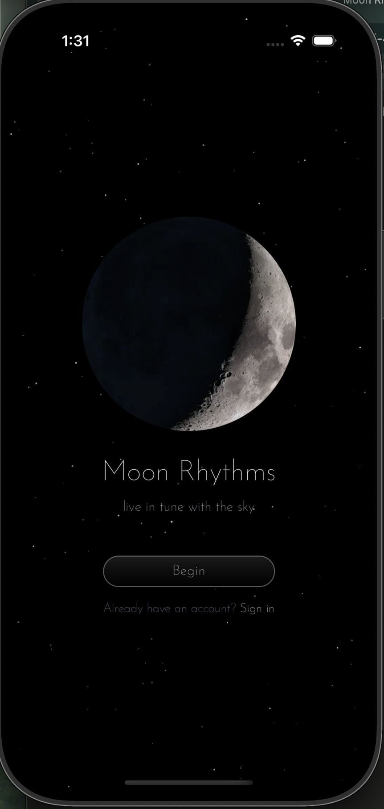
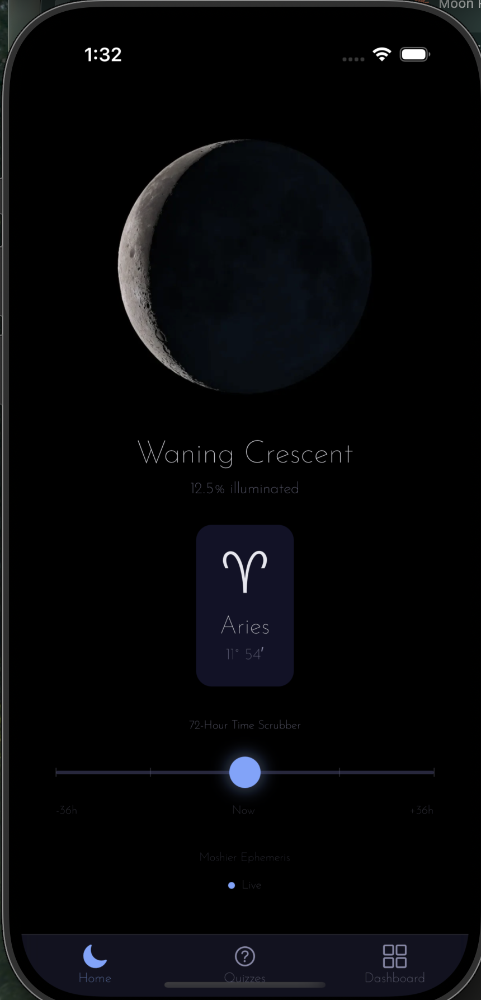
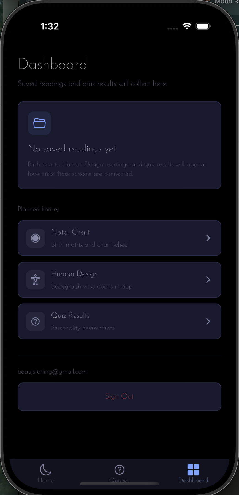

# Moon Rhythms Mobile

> Native mobile companion to [moonrhythms.io](https://moonrhythms.io) — a personalized astrology app that helps users understand their emotional patterns, relationships, and personal growth through their birth chart and current Moon cycles. Users can chat with an AI guide that explains their chart in simple, practical language, with paid features for relationship insights using a partner’s birth data. Over time, the app can surface meaningful Moon transits, patterns, and reflections to help users build self-awareness day by day.

Built with **Expo SDK 54**, **React Native**, **TypeScript**, and **Supabase**. This is my **Nucamp React Native Bootcamp Honors Project**.

---

## 📲 Try It On Your Phone

You can install the app directly — no code, no Xcode, no Android Studio. The latest build of either platform is always available at:

**👉 [expo.dev/accounts/beausterling/projects/moon-rhythms](https://expo.dev/accounts/beausterling/projects/moon-rhythms) 👈**

Pick your platform below for step-by-step instructions.

---

### 🍎 iPhone / iPad

iOS has one extra step (Apple's rules for testing outside the App Store): your device needs to be registered with my developer account first. Takes about a minute.

1. **Reach out** — [open an issue here](https://github.com/beausterling/moon-rhythms-mobile/issues/new?title=iOS+test+access+request) or message me directly. I just need to know you want to try it.
2. **I'll send you a registration link.** Open it in Safari *on your iPhone* (not your laptop). Tap **Allow** → go to **Settings → Profile Downloaded → Install** → enter your passcode.
3. **Open the build page** ([expo.dev/.../moon-rhythms](https://expo.dev/accounts/beausterling/projects/moon-rhythms)) in Safari on the same iPhone.
4. **Find the latest iOS build** (top of the list), tap it, then tap **Install**. iOS will ask you to confirm — say yes.
5. **App appears on your home screen.** Open it and you're in.

> The first time you run it, you may need to go to **Settings → General → VPN & Device Management** and trust my developer profile. iOS will prompt you if so.

---

### 🤖 Android

No registration step — just install the APK.

1. **Open the build page** on your Android phone: [expo.dev/.../moon-rhythms](https://expo.dev/accounts/beausterling/projects/moon-rhythms).
2. **Find the latest Android build** at the top of the list and tap **Install**. The `.apk` file (~50 MB) will download.
3. **Tap the downloaded file.** Android will warn you about installing from a non-Play Store source — tap **Settings**, enable **Allow from this source**, then go back and tap **Install**.
4. **App appears in your app drawer.** Open it and you're in.

> Real devices strongly recommended. Mac-hosted Android emulators can be sluggish on graphics-heavy screens like the Welcome animation — that's a known emulator limitation, not an app bug. The app runs smoothly on real Android hardware.

---

### What to expect when the app opens

1. **Welcome screen** — animated moon over a starfield. Tap **Begin**.
2. **Sign up** with email + password (or **Sign in** if you've used it before). Sessions persist so you only do this once per device.
3. **Home tab** — live moon position: zodiac sign, phase, illumination %, degree. Drag the time scrubber to peek up to 72 hours forward or back.
4. **Quizzes tab** — currently coming soon (Phase 4).
5. **Dashboard tab** — your saved readings (Phase 5 territory; sign-out lives here for now).

---

### Getting updates

Once installed, the app updates itself silently for most changes — you do nothing. Open it like normal and the new version is already there.

Occasionally I'll ship a "bigger" update (new feature module, SDK bump, etc.) that needs a fresh install. When that happens, I'll let testers know directly and you'll repeat the install steps above on the same link — no need to re-register your device on iOS, and Android just overwrites the old version.

If something looks broken or the app refuses to open after I push an update, force-quit and reopen once — that triggers the silent update to apply. If it's still broken, ping me.

---

## 📸 Screens

| Welcome | Home | Dashboard |
| :---: | :---: | :---: |
|  |  |  |
| Animated moon + starry background before auth | Live phase, illumination, zodiac sign, and 72-hour time scrubber | Saved birth charts and user data |

---

## ✨ Features

- **Live moon position** — current zodiac sign, phase name, illumination %, and degree, refreshed in real time
- **72-hour time scrubber** — drag back and forward in time to see where the moon was or will be (60fps Reanimated gestures)
- **Personality quizzes** — MBTI (32q), Big Five (50q), Enneagram (36q), DISC (28q). Scored client-side, work offline
- **Birth matrix** — natal chart and Human Design bodygraph from your birth data
- **Saved readings dashboard** — review your charts and quiz results, organized by type
- **Local notifications** — get pinged when the moon changes signs (no push server; transits are deterministic)
- **Offline-capable** — cached data with stale-indicator fallback
- **Persistent auth** — Supabase sessions stored via `expo-sqlite`

---

## 📱 Tech Stack

| Layer            | Choice                                            |
| ---------------- | ------------------------------------------------- |
| Framework        | Expo SDK 54 (managed workflow) + Expo Router     |
| Runtime          | React Native 0.81.5 / React 19.1                  |
| Language         | TypeScript (strict mode)                          |
| Styling          | NativeWind v4 (Tailwind CSS for React Native)     |
| Auth & DB        | Supabase (shared with the web app)                |
| Session storage  | `expo-sqlite` (localStorage polyfill)             |
| Animations       | React Native Reanimated 4 + Gesture Handler       |
| Images           | `expo-image` (CDN-cached moon frames)             |
| Notifications    | Local notifications (deterministic moon transits) |

---

## 🏗️ Architecture

Thin HTTP client. All astronomical calculations are server-side (Swiss Ephemeris on Node.js at moonrhythms.io). The mobile app consumes 14 API endpoints at `moonrhythms.io/api/`:

- **Public** endpoints (moon position, quizzes, chart data) — no auth required
- **Protected** endpoints (profile, readings, save-reading) — accept Bearer tokens

Quiz scoring is pure JS copied from the web app's `lib/` so it can run client-side for offline support.

Moon phase imagery comes from 712 pre-rendered WebP frames (indices 649–1360) served from the Vercel CDN at `moonrhythms.io/images/moon-cycle/moon.NNNN.webp`.

```
┌──────────────────────┐        ┌──────────────────────┐
│ Moon Rhythms Mobile  │  HTTP  │ moonrhythms.io       │
│ (this repo)          │ ─────► │ Next.js + Swiss Eph. │
│                      │        │                      │
│ Expo / RN / NW       │ ◄───── │ Vercel CDN (frames)  │
└──────────────────────┘        └──────────────────────┘
         │
         │ Auth + reads/writes
         ▼
   ┌──────────────┐
   │   Supabase   │
   └──────────────┘
```

---

## 🚀 Getting Started

### Prerequisites

- **Node.js** ≥ 18
- **npm** ≥ 10
- **Xcode** (for iOS Simulator) or **Android Studio** (for the Android Emulator)
- An **Expo Go** install on a physical device works too

### Install

```bash
git clone https://github.com/beausterling/moon-rhythms-mobile.git
cd moon-rhythms-mobile
npm install
```

### Environment

Create `.env.local` in the project root:

```env
EXPO_PUBLIC_SUPABASE_URL=your-supabase-url
EXPO_PUBLIC_SUPABASE_ANON_KEY=your-supabase-anon-key
EXPO_PUBLIC_GOOGLE_MAPS_API_KEY=your-google-maps-key
```

### Run

```bash
npx expo start -c
```

Then press `i` for iOS Simulator, `a` for Android Emulator, or scan the QR code in Expo Go on your device.

---

## 📂 Project Structure

```
moon-rhythms-mobile/
├── app/                      # Expo Router (file-based routes)
│   ├── _layout.tsx           # Root layout: fonts, providers, gate
│   ├── (auth)/               # Pre-auth stack
│   │   ├── welcome.tsx       # Welcome screen w/ moon loop animation
│   │   ├── sign-in.tsx
│   │   └── sign-up.tsx
│   └── (tabs)/               # Authenticated tab nav
│       ├── index.tsx         # Home: live moon + 72h scrubber
│       ├── quizzes.tsx       # Personality quizzes
│       └── dashboard.tsx     # Saved readings
├── components/               # Shared UI
├── hooks/                    # React hooks (useMoonPosition, etc.)
├── lib/                      # API client, moon-calc, scoring
├── assets/                   # Fonts, icons, splash
├── supabase/                 # Migration scripts
└── docs/                     # Internal docs
```

---

## 🗺️ Roadmap

- [x] **Phase 1 — Foundation & Auth.** Tab nav, dark theme, Josefin Sans, Supabase auth with persistent sessions, sign in/up/out flows
- [x] **Phase 2 — Home Screen.** Live moon position, 72-hour scrubber, offline fallback
- [ ] **Phase 3 — Birth Matrix.** Birth-data entry, natal chart SVG wheel, Human Design bodygraph (WebView v1)
- [ ] **Phase 4 — Personality Quizzes.** MBTI, Big Five, Enneagram, DISC with client-side scoring
- [ ] **Phase 5 — Dashboard.** Saved readings viewer with offline cache
- [ ] **Phase 6 — Notifications & Settings.** Moon-sign-change notifications, settings screen
- [ ] **Phase 7 — Moon Animation.** Full-year animated moon player
- [ ] **Phase 8 — Platform Polish.** iOS/Android Simulator verification, safe-area handling, keyboard avoidance

---

## 🎨 Design Tokens

| Token            | Value     | Use                                 |
| ---------------- | --------- | ----------------------------------- |
| `background`     | `#0a0a1a` | Deep navy — 60% dominant            |
| `surface`        | `#12122a` | Cards, input fields                 |
| `border`         | `#2a2a4a` | Input borders (idle)                |
| `text-primary`   | `#e8e8f0` | Body text                           |
| `text-secondary` | `#8888aa` | Muted labels, placeholders          |
| `accent`         | `#7BA5FF` | CTAs, active tab, focused borders   |
| `destructive`    | `#ef4444` | Error text, error borders           |

**Typography:** Josefin Sans (400 Regular, 600 SemiBold)
**Spacing:** multiples of 4px. Touch targets ≥ 44×44px.

---

## 🔗 Related

- **Web companion:** [moonrhythms.io](https://moonrhythms.io)
- **Source for astronomical calculations:** Swiss Ephemeris (server-side)

---

## 🎓 About

This project is my **Honors Project** for the [Nucamp](https://www.nucamp.co) React Native Mobile App Development bootcamp. It's a real, ship-ready mobile companion to a production web app I built — exercising end-to-end product thinking, native UX patterns, offline-capable design, and integration with an existing backend.

---

## 👤 Author

**Beau Sterling**
[github.com/beausterling](https://github.com/beausterling)
